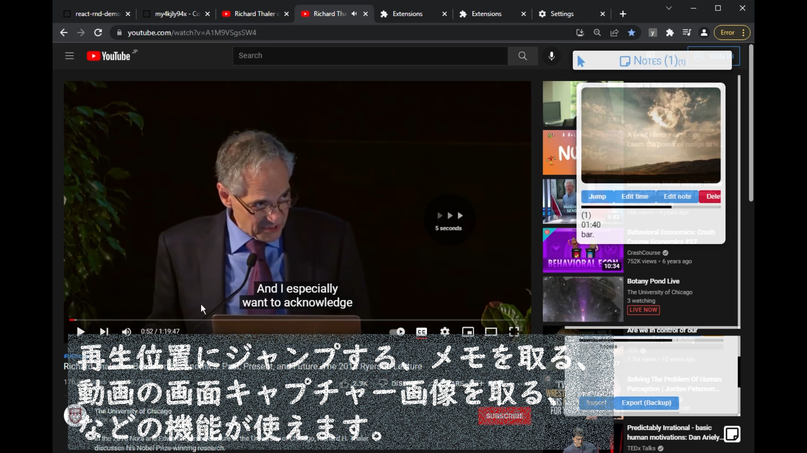

# YtNote by YuipApps 

This is a beta/free release version of the Chrome extension (1) "YtNote by YuipApps" from YuipApps. 

Compatible with: 

- Chrome
- Firefox
- Opera
- Microsoft Edge
- Android Chrome
- Kiwi Browser
- iPhone Safari

(1): I said Chrome extension, but it is just a Javascript code, that doesn't depend on any particular browser. Thus, the app is fully compatible with any other browsers; All you want to launch the app is run a single line of code.

<a href="https://www.youtube.com/watch?v=LgTR5WK2YF4">
  <p align="center">
    
    
  </p>
  <p align="center">
    Click the above images to jump to the YouTube tutorial!
  </p>
</a>

  
## Quick Start 

Copy the following code and paste onto your browser's URL address bar, enter to launch the app. 

```js
javascript:(async () => { await import("https://cdn.jsdelivr.net/gh/yuis-ice/ytnote@0.1.4/bundle.js"); })();
```

**REMEMBER**, in most browsers for a security reason when you pasted "javascript:.." urls, it's trimmed automatically; So if the app doesn't launch, please double-check if you have the correct url that has the "javascript:" at the first of the url.

You can also paste the above url onto the developer tools console. Open the dev tools with ctrl-shift-i, then click the console tab, then paste it. 

If you have a problem on the app launch, feel free to open an issue here. **HOWEVER**, we don't need bug reportings, since we know that the app has many bugs as the app is beta.

## Warning

The app is on beta release. I confirmed there are multiple bugs on the app. 

Bug examples and workarounds: 

- don't click the "show metadata" buttons; it freezes your youtube tab. 
- when your tab/window/browser freezed, close the tab asap (you can use the shortcut key ctrl-w) then reopen it (ctrl-shfit-t); but remember that in the worst cases, your browser might be crashed

1. always backup your works before using the app. 
2. backing up your chrome tabs using an extension such as [session buddy](https://chrome.google.com/webstore/detail/session-buddy/edacconmaakjimmfgnblocblbcdcpbko) is recommended

## Discraimer

THE SOFTWARE IS PROVIDED "AS IS", WITHOUT WARRANTY OF ANY KIND, EXPRESS OR IMPLIED, INCLUDING BUT NOT LIMITED TO THE WARRANTIES OF MERCHANTABILITY, FITNESS FOR A PARTICULAR PURPOSE AND NONINFRINGEMENT. IN NO EVENT SHALL THE AUTHORS OR COPYRIGHT HOLDERS BE LIABLE FOR ANY CLAIM, DAMAGES OR OTHER LIABILITY, WHETHER IN AN ACTION OF CONTRACT, TORT OR OTHERWISE, ARISING FROM, OUT OF OR IN CONNECTION WITH THE SOFTWARE OR THE USE OR OTHER DEALINGS IN THE SOFTWARE
