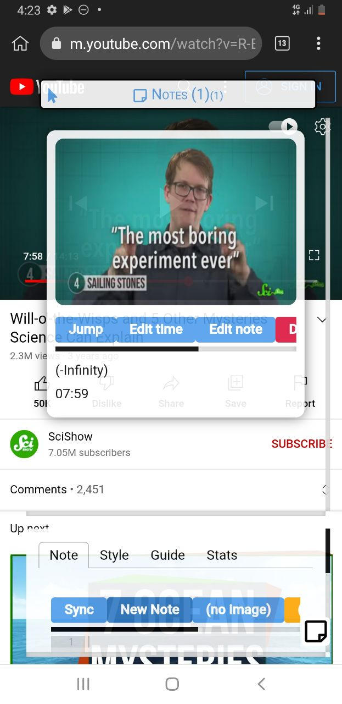

# ✍️ YtNote by YuipApps 

This is a beta/free release version of the Chrome extension (1) "YtNote by YuipApps" from YuipApps. 

Compatible with: 

- Chrome
- Firefox
- Opera
- Microsoft Edge
- Chromium
- Brave Browser
- Android Chrome
- Kiwi Browser
- iPhone/iOS Safari
- and many more.

(1): I said Chrome extension, but it is just a Javascript code, that doesn't depend on any particular browser. Thus, the app is fully compatible with any other browsers; All you want to launch the app is run a single line of code.

<a href="https://www.youtube.com/watch?v=LgTR5WK2YF4">
  <p align="center">
    
    
  </p>
  <p align="center">
    Click the above images to jump to the YouTube tutorial!
  </p>
</a>

## Table of Contents 

- [Quick Start](#quick-start)
- [Warning](#warning)
- [Auto Startup](#auto-startup)
- [YtNote Pro](#ytnote-pro)
- [Discraimer](#discraimer)

## Quick Start 

Copy the following code and paste onto your browser's URL address bar, enter to launch the app. 

```js
javascript:(async () => { await import("https://cdn.jsdelivr.net/gh/yuis-ice/ytnote/bundle.js"); })();
```

**REMEMBER**, in most browsers for a security reason when you pasted "javascript:.." urls, it's trimmed automatically; So if the app doesn't launch, please double-check if you have the correct url that has the "javascript:" at the first of the url.

You can also paste the above url onto the developer tools console. Open the dev tools with ctrl-shift-i, then click the console tab, then paste it. 

If you have a problem on the app launch, feel free to open an issue here. **HOWEVER**, we don't need bug reportings, since we know that the app has many bugs as the app is beta.

## Warning

The app is on beta release. I confirmed there are multiple bugs on the app. 

Bug examples and workarounds: 

- don't click the "show metadata" buttons; it freezes your youtube tab. 
- when your tab/window/browser freezed, close the tab asap (you can use the shortcut key ctrl-w) then reopen it (ctrl-shfit-t); but remember that in the worst cases, your browser might be crashed

1. always backup your works before using the app. 
2. backing up your chrome tabs using an extension such as [session buddy](https://chrome.google.com/webstore/detail/session-buddy/edacconmaakjimmfgnblocblbcdcpbko) is recommended

**Pro tip:**

A quick and safe way to try out the app is launching the app in the new Chrome instance. Open cmd.exe or powershell.exe then run i.e: 

```sh
chrome.exe --user-data-dir="C:\Users\username\chrome-tmp"
```

## Auto Startup 

You can config the app automatically starting on YouTube URL visits using a userscript such as Tampermonkey. 

1. Install the [Tampermonkey • Chrome](https://www.tampermonkey.net/) Chrome extension for Chrome/Brave/Kiwi or [Greasemonkey](https://addons.mozilla.org/en-US/firefox/addon/greasemonkey/) for Firefox.
2. Install the userscript [here](https://github.com/yuis-ice/ytnote/raw/main/userscript/main.user.js).

## YtNote Pro

In the coming months, we're going to publish the alpha release of YtNote, a.k.a. "YtNote Pro". 

YtNote Pro includes following features at this moment. 

- **Much faster** 
- **Saves notes**, state, data between tabs 
- **YouTube, BiliBili, Twitch, Vimeo, Niconico**, and more video streaming sites 
- Constant **bug fixes and feature updates** 
- **Forum support** 

We will update here when the app is ready to release. But in the case if you prefer to get notified when we have released the app, you can join to our mailing list. If you prefer that, email us via the following email, including a text message "**subscribe to YtNote Pro news**" (case insensitive).


Please note that, the email is not for support in any way. We don't check all support requests, advertisements, business contacts coming to this address.

## Discraimer

THE SOFTWARE IS PROVIDED "AS IS", WITHOUT WARRANTY OF ANY KIND, EXPRESS OR IMPLIED, INCLUDING BUT NOT LIMITED TO THE WARRANTIES OF MERCHANTABILITY, FITNESS FOR A PARTICULAR PURPOSE AND NONINFRINGEMENT. IN NO EVENT SHALL THE AUTHORS OR COPYRIGHT HOLDERS BE LIABLE FOR ANY CLAIM, DAMAGES OR OTHER LIABILITY, WHETHER IN AN ACTION OF CONTRACT, TORT OR OTHERWISE, ARISING FROM, OUT OF OR IN CONNECTION WITH THE SOFTWARE OR THE USE OR OTHER DEALINGS IN THE SOFTWARE
